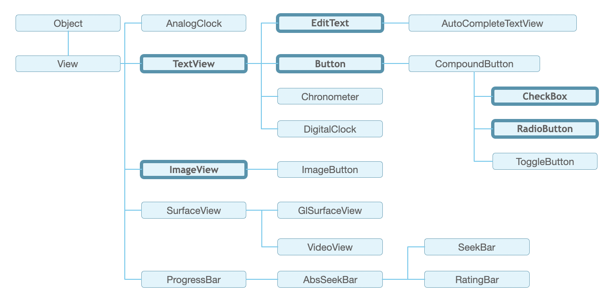

# 안드로이드(Android)

Java 기반의 Framework

JNI(Java Native Interface)를 통한 native C/C++ 코드로 맵핑

핵심 시스템 서비스를 담당하는 core 시스템 서비스 + 하드웨어와의 인터페이스를 담당하는 하드웨어 서비스

## 안드로이드 구조

### 안드로이드 런타임(Runtime)

- Core Libraries

  : Java 언어를 위한 Core API를 포함

  (Data Structure, File Access, Utility, Graphic, Network Access, etc.)

- ART

  : Java Bytecode 수행

  가상머신을 거치지 않고 곧바로 애플리케이션을 실행해 속도 향상

### 라이브러리 (Libraries)

- Surface Manager

- Media Framework

- OpenGL ES

- SQLite

- Blink

### 리눅스 커널 (Kernel)

리눅스 커널을 기반으로 하고 있지만, 안드로이드는 리눅스가 아님.

안드로이드 지원을 위해 리눅스 커널 확장 패치를 포함.

### 코드 구조

- Java : 기능(이벤트)을 담당

- Xml : 화면 UI를 담당

## View

- view : UI를 구성하는 기본적인 블럭

- Widget : 애플리케이션 화면에 사용되는 UI요소 (View를 상속받음)

  (TextView, ImageView, Button etc.)

- View Group : View 집합

  (Layout, etc.)

- App Widget

  안드로이드 기본 화면에서 동작하는 애플리케이션.

  (!= 위젯)

### view 크기 설정

- dp : 화면 밀도에 기반한 단위

- sp : dp와 동일한 크기지만 시스템 폰트 크기에 따라 사이즈 변경

텍스트 크기 지정에는 sp, 그 외에는 dp 사용 권장

## Widget

(TextView, ImageView, Button, etc.)

### TextView

화면에 텍스트 출력하는 위젯.

사용자 입력X

- 속성

  - text : 출력 문자열 지정 ("text"형식)

  - textColor : 문자열 색상 지정 (#RRGGBB형식)

  - textSize : 문자열 크기 지정 (sp, dp, px 등의 단위)

  - textStyle : 문자열 형태 지정 (Normal, Bold, italic)

## View Group

## Activity
