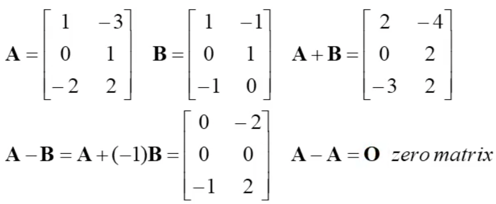

## Matrix Arithmetic

matrix끼리 더하거나 곱하거나 그들의 값을 구하는 것

row vector를 표시할 때, 바(-)를 사용.

하지만 벡터는 column vector로 표기할 때가 많다.
즉,

### Equality, Scalar Multiplication(스칼라값 곱하기)

두 matrix 모든 같은 위치에 같은 값을 가진다면, 같은 matrix라고 한다.

어떤 matrix에 스칼라(scalar)값이 곱해진다면, 모든 엔트리에 해당 스칼라 값이 곱해진다.

### Matrix Addition(더하기)

동일한 위치에 있는 엔트리끼리 더하는 것

### Matrix Multiplication(곱하기)

A의 column의 갯수와 B의 row의 갯수가 같아야 AxB를 곱할 수 있다.

## Matrix Algebra

## Elementary Matrices

## Partitioned Matrices

## Applications
