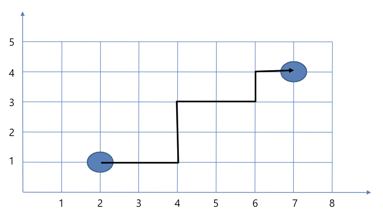
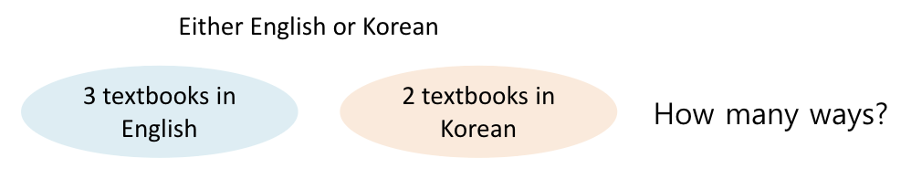
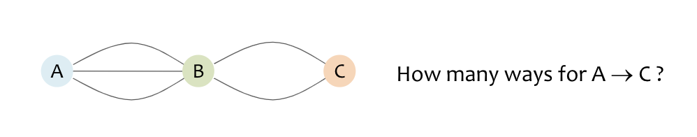
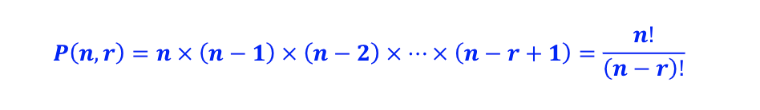

> ### Q1. How many paths from (2,1) to (7,4) in the xy-plane?

=> **Permutation**

> ### Q2. Do any tow people in Busan have the same number of hairs on their head?
>  - A typical human head has an average of around 150,000 hairs, it is reasonable to assume (as an upper bound) that no one has more than 1,000,000 hairs on their head
>  - The population of Busan is about 3.4 millions
>> Q2. In this problem, what is 'pigeon'? 'hole'?

hole : 머리카락 갯수, pigeon : 사람 수

- number of holes = 1,000,000

- number of pigeons = 3,400,000

=> 따라서, 머릿카락이 같은 사람이 있을 수 밖에 없다

 

# Principle of Counting

## Rules of Sum and Product

### 1. Rules of Sum

m가지 방법으로 실행되는 일과 n가지 방법으로 실행되는 일이 동시에 발생하지 않는다면, 
일을 수행할 방법은 m+n가지 이다.

first task can be performed in **"m"** ways(1), while a second task in **"n"** ways(2), and the two tasks **cannot** be performed **simultaneously**(3)

then, **performing either task** can be accomlished **in any one of m + n ways**

> Q4. Travel Options
> - You need to travel in between city A and B.
> - You can either fly, take a train, or a bus.
> - There are 12 different flight in between A and B, 5 different trains and 10 buses.
> - How many options do you have to get from A to B?
> => 12 + 5 + 10 = 27

> Q5. # of Possible Password
> - The minimul length of the password is 1 and the maximum is 3.
> - The password can consist of only the uppercase letters (A~Z).
> - How many cases are there for the possible password?
> => 26 + 26x26 + 26x26x26 = 18,278

### 2. Rule of Product

순서가 있는데, 첫번째는 m개의 가능한 방법이 있고, 두번째는 n개의 가능한 방법이 있다. 전체 가능한 절차는 
총 mxn 가지 이다.

If a procedure can be broken down into first & second stages(1),

and if there are **m possible outcomes** for the first stage(2) and

if, for each of these outcomes, there are **n possible outcomes** for the second stage(3), then the total procedure can be carried out, in the designated order, **in mxn ways**

> Q6. How many different bit strings of length 7 are there? (for example, 1011010)
> => 2^7 = 128

> Q7. The license plate of the car is consisted of two alphabet letters followed by four digits
> => 26x26x10^4 = 676x10^4

## Permutations (순열)

\#arrangement \#order

순서를 가지고 나열!

> Q8. The number of permutaions of the letters in the word "COMPUTER"
> => 8!

> Q9. If only five of the letters are used
> => 8C5 x 5!

> Q10. If 'C' and 'O' should be 

## Combinations : Binomial Theorem

## Combinations with Repetition

## Pigeonhole Principle

