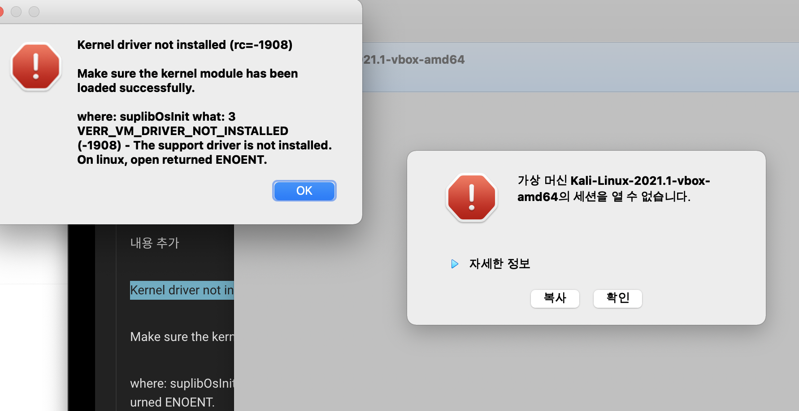
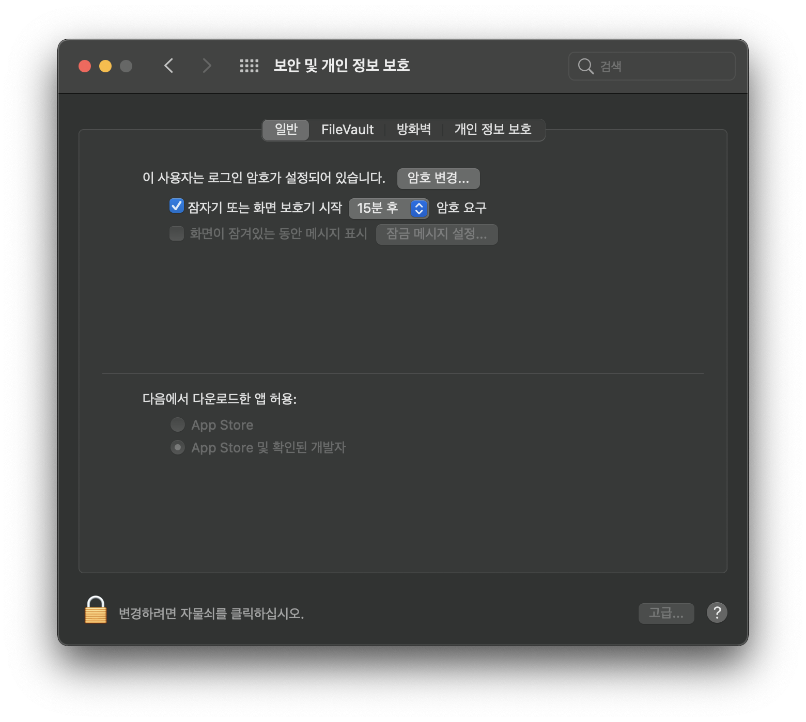
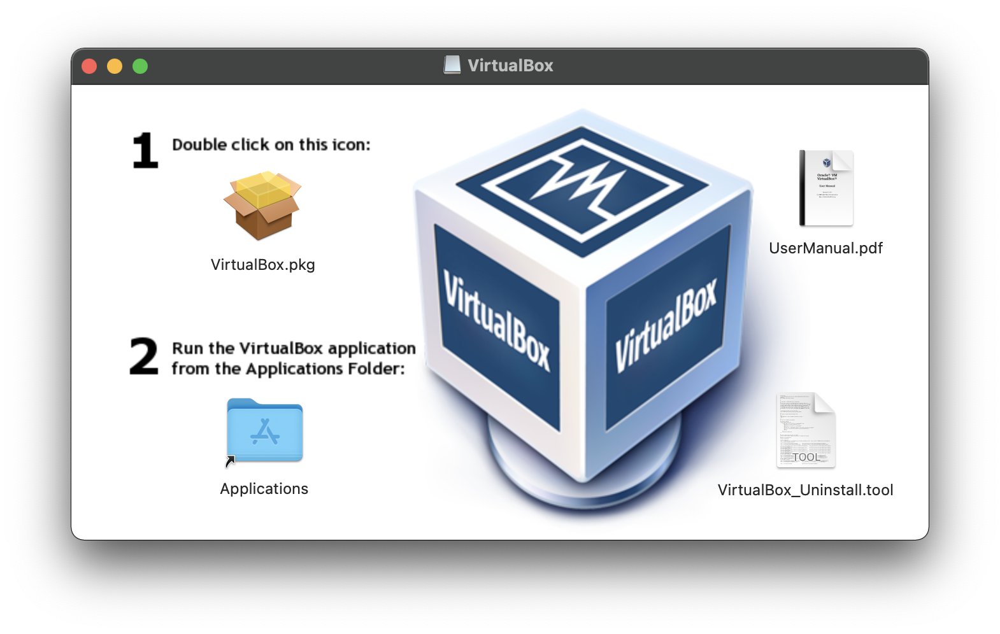
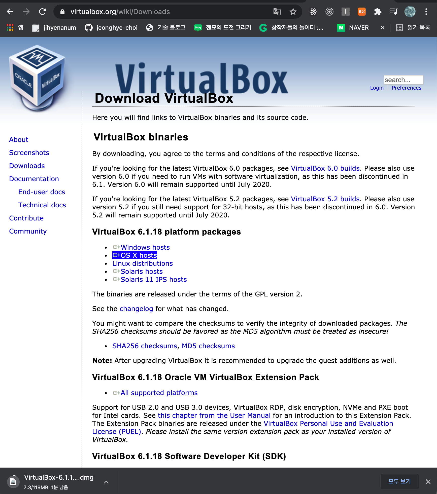
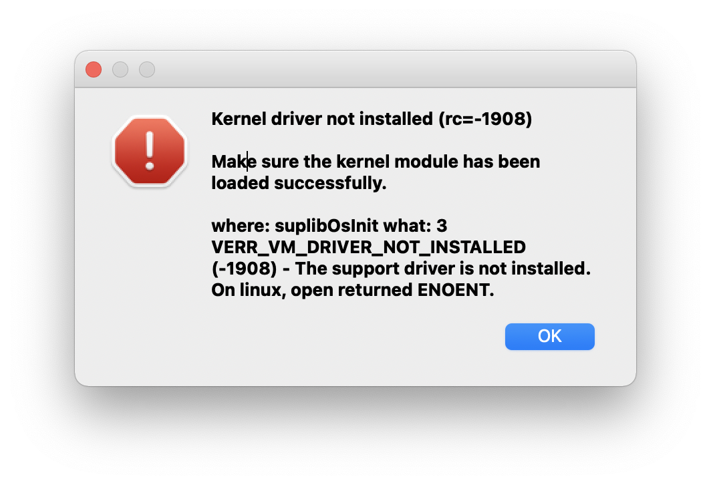
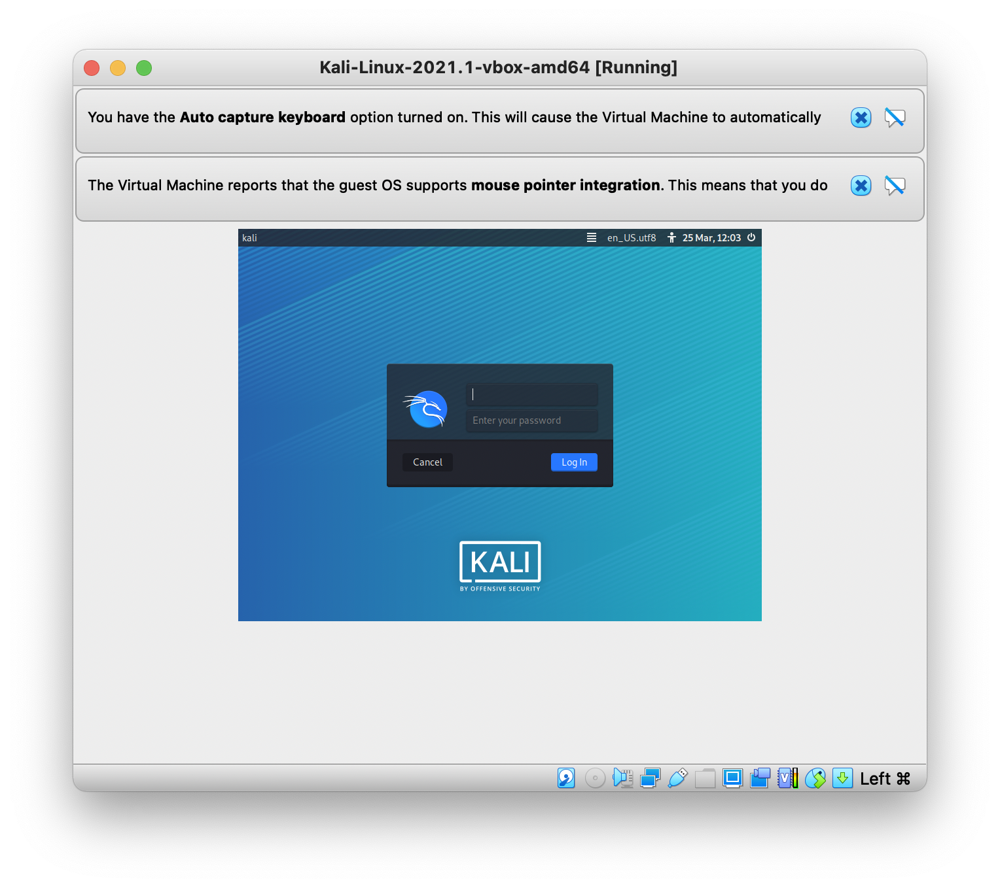
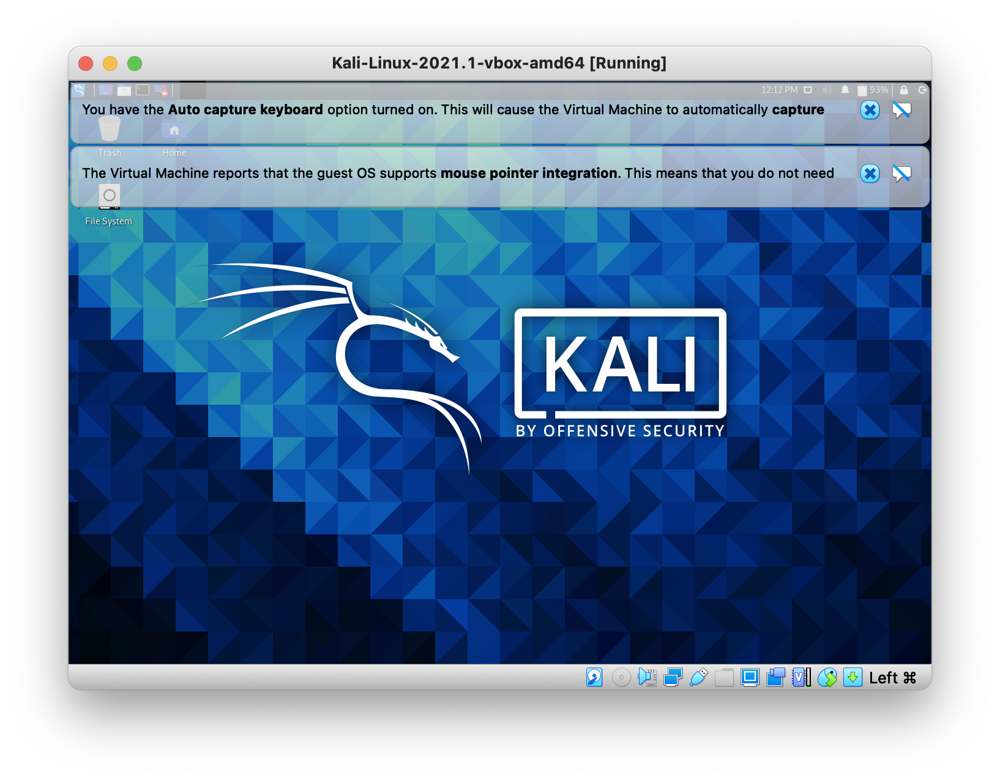

<br/>

맥에서는 모르는 프로그램에 대해 실행 권한이 필요하다.
권한을 주지 않았을 때, 커널쪽에서 처리하지 못해서 생기는 오류라고 한다.

즉, 시스템 바닥까지 가서 처리해야하는데 그러지 못해서 생긴 에러다.

해결방법은, 이걸 실행하는 곳에서 보안 및 개인정보 보호에서 허용 하면되지만...



아무것도 안보임..!!

찾아보니까 처음 설치하고 실행했을 때 뜨는데, 그때 30분안에 하지 않으면 안보인다고..
빅서에게 두번의 기회는 없다고ㅠㅜ

<br/>

## 시도했던 다른 방법들

해결방법을 찾아봤었는데

1 복구모드에서 터미널에 "curutil disable; reboot"입력해서 가상머신 다시 설치하기

2 아래 링크에 있는 방법들

(https://medium.com/@DMeechan/fixing-the-installation-failed-virtualbox-error-on-mac-high-sierra-7c421362b5b5)

이 방법들 모두 되지 않았다ㅠㅜ

오라클 프로그램 허용이 이렇게 까다로울 일인가 싶긴하지만 보안을 위한 거라는데 어쩔 수 있나ㅠㅜ

<br/>

## 결국 해결한 방법

돌고돌아 해결한 방법은 VirtualBox를 **"깨끗하게"** 지우고 다시 설치하는 것이였다.

### > 1. Uninstall



VirtualBox 인스톨러를 다운받아서 오른쪽 밑에 있는 "VirtualBox_Uninstall.tool"을 더블클릭!

언인스톨러를 사용해서 지워야 깔끔하게 지워진다. 절대로 그냥 휴지통에 넣으면 안된다!! 맥용 클리너보단 이 스크립트를 터미널에서 돌리기를 더 추천!

```
Do you wish to uninstall VirtualBox (Yes/No)?
Yes
...

Do you wish to uninstall the FUSE for macOS core package (Yes/No)?
Yes
...

[프로세스 완료됨]
```

<br/>

### > 2. 다시 설치



그래도 아무 것도 안떠서 삭제하고 설치하기를 한 세번정도 반복했다.(더이상은 어떻게 해야할지 모르겠어서..)

그렇게 다시 설치한지 세 번 만에, 보안 및 개인 정보 보호에 '재시동'버튼이 활성화 되었다. (새로운 시스템 확장 프로그램을 사용하기 전에 재시동 해야한다는 말과 함께)

클릭!!

재시동 후 가상머신 부르고 다시 보안 및 개인 정보 보호를 확인하니까 '재시동'버튼이 또 활성화 되어있었다. (개발자 'Oracle America, Inc.'관련 메세지와 함께)

그래서 재시동 후 가상머신 불러오니까 또 에러...(제발ㅠㅜㅠ)



### > 3. Install VirtualBox extension

알고보니까 VirtualBox extension을 다시 설치해야했다.


--> [가상머신 사이트](https://www.virtualbox.org/wiki/Downloads)에서 설치.

<br/>

드디어!! 드디어 실행된다!!


초기 아이디 kali 비밀번호 kali



너무너무 감동스러운 화면><

<br/>

## 후기

해결되고서 생각해보니 그동안 깔끔하게 지우지 않았던게 원인이였던 것 같다. (uninstaller가 괜히 있는게 아닌게지ㅎㅎ)

이 에러는 새로운 분야의 공부를 위한 초기 환경설정 과정에서 만났는데, 첫 한걸음부터 난관이였어서 힘들었지만 그래도 오래걸려도 계속 붙잡고 있었던 보람은 있어서 좋다^^

매번 느끼는 거지만 포기하지만 않으면 아무리 허무한 이유때문이여도 얻는건 분명 있는거 같다:)
