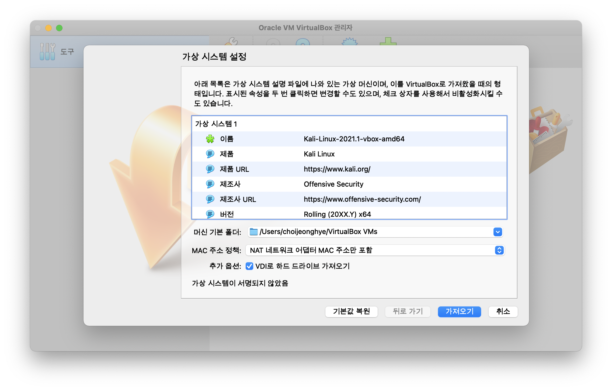
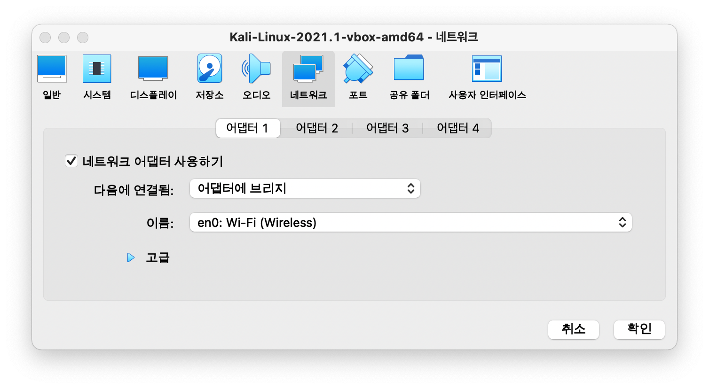

## 1. VirtualBox 설치

다운받기 -> [VirtualBox downloads](https://www.virtualbox.org/wiki/Downloads)

다운된 dmg 파일 실행

 

## 2. Kali Linux 설치

이미지로 설치 -> [Kali downloads](https://www.kali.org/downloads/)

Offensive Security VM Download Page 누르기

 

KALI LINUX VIRTUALBOX IMAGES 클릭

 

## 3. 이미지 가져오기

가져오기 클릭! > 동의합니다

 

## 4. 설정(1) : 포트 > USB

'USB 1.1(OHCI) 컨트롤러' 선택

 

## 4. 설정(2) : 네트워크 > 어댑터1

- 브리지 : 지금 사용하고 있는 네트워크를 같이 사용.

- NAT : VirtualBox 내부에 또다른 네트워크를 만들어서 아이피를 할당.

네트워크 브릿지를 연결해주면, 와이파이에 연결된 모든 기기가 이 칼리리눅스에 연결할 수 있다.

 

## 실행

에러발생

해결 => [Error Kernel driver not installed](https://jeonghye-choi.github.io/VirtualBoxError/)

초기 아이디 kali 비번 kali

실행!!
