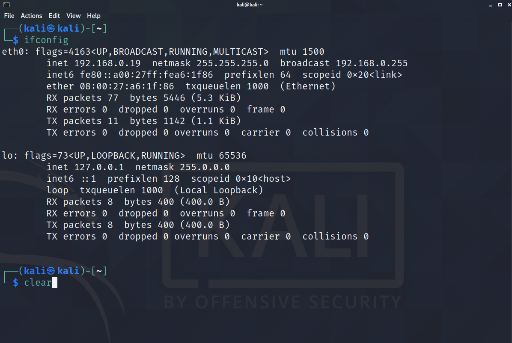

# Kali Linux 설치

## 1. VirtualBox 설치

다운받기 -> [VirtualBox downloads](https://www.virtualbox.org/wiki/Downloads)

다운된 dmg 파일 실행


<br/>

## 2. Kali Linux 설치

이미지로 설치 -> [Kali downloads](https://www.kali.org/downloads/)


Offensive Security VM Download Page 누르기

<br/>


KALI LINUX VIRTUALBOX IMAGES 클릭

<br/>

## 3. 이미지 가져오기


가져오기 클릭! > 동의합니다

<br/>

## 4. 설정(1) : 포트 > USB


'USB 1.1(OHCI) 컨트롤러' 선택

<br/>

## 4. 설정(2) : 네트워크 > 어댑터1


- 브리지 : 지금 사용하고 있는 네트워크를 같이 사용.

- NAT : VirtualBox 내부에 또다른 네트워크를 만들어서 아이피를 할당.

네트워크 브릿지를 연결해주면, 와이파이에 연결된 모든 기기가 이 칼리리눅스에 연결할 수 있다.

<br/>

## 실행

에러발생

해결 => [Error Kernel driver not installed](https://jeonghye-choi.github.io/VirtualBoxError/)


초기 아이디 kali 비번 kali


실행!!

<br/>
<br/>

# Kali Linux 환경설정

## 0. Terminal Emulator 클릭


<br/>

## 1. 네트워크 연결 확인

```
$ ifconfig
```


eth0에 inet 확인.

<br/>

화면 깨끗!

```
$ clear
```



<br/>

## 2. 데이터 정상적으로 나가는 지 확인

```
$ ping 8.8.8.8
```


확인 후 ctrl+c 눌러서 중단하기

<br/>

## 3. Kali Linux의 root계정 관리자 권한(최고권한)으로 바꾸기

root는 리눅스에서 최고권한 (관리자 권한)

```
$ sudo su -
```


초기 비밀번호 'kali' 입력

비밀번호가 안보이는 건 정상.

화면에 나오지 않을 뿐 입력되고 있음.


kali -> root, \$ -> # 로 변경됐다.


<br/>

## 4. 비밀번호 변경

```
# passwd
```

새로운 비번 입력

-> 다시 입력

-> 성공!


<br/>

## 5. 업데이트

```
# apt-get update
```


<br/>

## 세팅끝!!

Kali Linux 종료

```
# poweroff
```

<br/>

아이디 root 비번 (새로 설정한 비밀번호)


