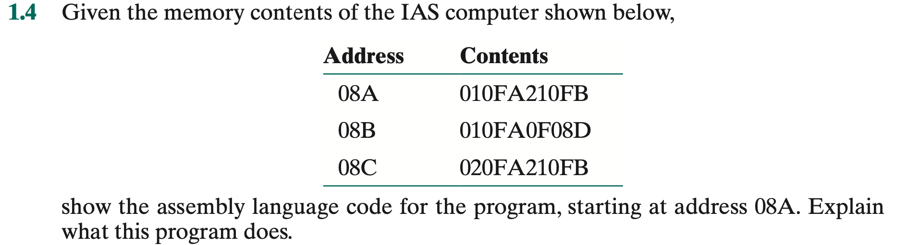

# Q1.4 IAS

명령어는 08A -> 08B -> 08C 순서대로 읽어진다.

08A : 010FA210FB
08B : 010FA0F08D
08C : 020FA210FB

IAS의 메모리는 총 40bits로 이뤄져있다.
명령어는 left, right으로 나눠서 두개가 들어가 있고
각 instruction은 opconde 8비트와 address 12비트로 나눠졌다.

(opcode + address) + (opcode + address)

위의 명령어(instruction)을 해석해보면

010FA210FB

= (01 + 0FA) + (21 + 0FB)

010FA0F08D

= (01 + 0FA) + (0F + 08D)

020FA210FB

= (02 + 0FA) + (21 + 0FB)

## 16비트로 주어진 opcode를 이진수로 바꿔서 확인

opcode : 01, 02, 21, 0F

01 = 0000 0001 = LOAD M(X)

02 = 0000 0010 = LOAD -M(X)

21 = 0010 0001 = STOR M(X)

0F = 0000 1111 = JUMP+ M(X,0:19)

## 해석

1. LOAD M(0FA) : Transfer M(X) to the accumulator

0FA에 있는 값을 accumulator에 복사.

2. STOR M(0FB) : Transfer contents of accumulator to memory location X

accumulator에 있는 값을 0FB 메모리에 저장.

3. LOAD M(0FA) : Transfer M(X) to the accumulator

0FA에 있는 값을 accumulator에 복사.

4. JUMP+ M(08D,0:19) : If number in the accumulator is nonnegative, take next instruction from left half of M(X)

accumulator안의 값이 음수가 아니라면, 다음 명령어 08D의 왼쪽부터 실행해라.

5. LOAD -M(0FA) : Transfer -M(X) to the accumulator

(음수가 아닐때(0과 양수일때)는 이 5,6번째 명령어가 실행되지 않음 = 양수와 0일때 이 명령어가 실행됨)

0FA에 있는 값에 -를 붙여서 accumulator에 복사.

6. STOR M(0FB) : Transfer contents of accumulator to memory location X

accumulator에 있는 값을 0FB 메모리에 저장.

## 결론

address 0FA 안에 있는 값을 절대값을 취해 address 0FB에 넣는 과정의 코드
