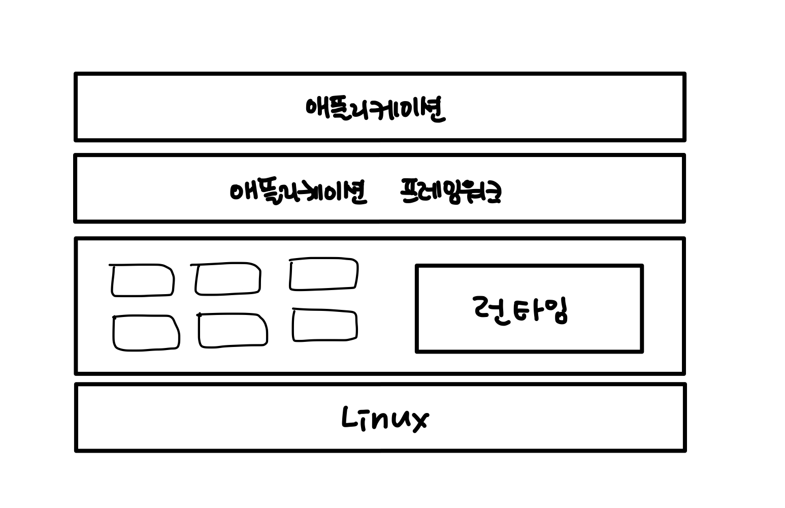

## 안드로이드의 이해

- 스마트폰의 대중화

  구글의 안드로이드 - 오픈(open)을 통해 스마트폰 대중화

  => 많은 제조사와 유통사와 연결되었다.

  앱스토어, 플래이스토어를 통해 수익창출이 가능해졌다.

- 안드로이드의 특징

  **오픈소스**

  - **완벽한 컴포넌트**

  - 자바

  - 쉬운 앱 간 연동

  - 다양한 하드웨어 지원

- 안드로이드 플랫폼 아키텍쳐

  - 리눅스 위에 자바를 쓴다 + 리눅스에서 자바를 사용할 수 있게 하는 런타임

  - 리눅스위에 필요하면 라이브러리를 올릴 수 있음(C 나 C++을 올리곤 함)

  

- 안드로이드 점유율

  - 안드로이드 87.5%, 애플 11.9%
