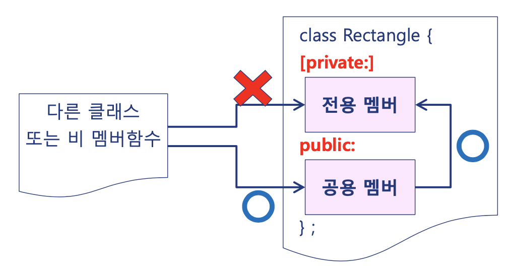

클래스 = 객체들의 집합

### 구조

```cpp
class 클래스이름{
private:
    데이터 멤버
public:
    멤버 함수
};
```

#### Example: Rectangle 클래스

```cpp
#include <iostream>
using namespace std;

class Rectangle {
private:
    int leftTopX, leftTopY;
    int rightBottomX, rightBottomY;
public:
    Rectangle (int x1, int y1, int x2, int y2){
        set(x1, y1, x2, y2);
    }
    void set(int x1, int y1, int x2, int y2){
        leftTopX = x1;
        leftTopY = y1;
        rightBottomX = x2;
        rightBottomY = y2;
    }
    void getLeftTop(int& x, int& y){
        x = leftTopX;
        y = leftTopY;
    }
    void getRightBottom(int& x, int& y){
        x = rightBottomX;
        y = rightBottomY;
    }
    int getArea(){
        return (rightBottomX-leftTopX)*(rightBottomY-leftTopX);
    }
};


int main(){
    Rectangle r1(10, 10, 20, 20);

    int x1, y1, x2, y2;
    r1.getLeftTop(x1, y1);
    r1.getRightBottom(x2, y2);

    Rectangle r2(x1+10, y1+10, x2+10, y2+10);

    cout << r1.getArea() << '\t' << r2.getArea() << endl;
}
```

### private & public

정보은닉



information hiding 하는 방법.

private는 오직 클래스 내부에서만 접근 가능.

#### Example: 클래스정의

- Rectangle.h

      ```cpp
      #ifndef Rectangle_h
      #define Rectangle_h

      class Rectangle {
          int leftTopX, leftTopY;
          int rightBottomX, rightBottomY;
          // 클래스 내부에서 정의된 멤버 함수는 기본적으로 inline함수.
          void setLeftTop(int x, int y){
              leftTopX = x;
              leftTopY = y;
          }
          void setRightBottom(int x, int y){
              rightBottomX = x;
              rightBottomY = y;
          }

      public:
          // 자신의 멤버함수 호출
          void set(int x1, int y1, int x2, int y2){
              setLeftTop(x1, y1);
              setRightBottom(x2, y2);
          }
          void getLeftTop(int& x, int& y){
              x = leftTopX;
              y = leftTopY;
          }
          void getRightBottom(int& x, int& y){
              x = rightBottomX;
              y = rightBottomY;
          }

          int getWidth(){
              return rightBottomX - leftTopX;
          }
          int getHeight(){
              return rightBottomY - leftTopY;
          }

          // 별도의 구현 파일을 이용함.
          int getArea();
          void moveBy(int deltaX, int deltaY);

      };

      #endif
      ```

- Rectangle.cpp

  ```cpp
  #include "Rectangle.h"

  // 클래스 멤버 함수를 클래스 외부에 정의하고 있음
  int Rectangle::getArea(){
      return getWidth()*getHeight();
  }

  void Rectangle::moveBy(int deltaX, int deltaY){
      setLeftTop(leftTopX+deltaX, leftTopY+deltaY);
      setRightBottom(rightBottomX+deltaX, rightBottomY+deltaY);
  }

  ```

- RectangleMain.cpp

  ```cpp
  #include <iostream>
  #include "Rectangle.h"
  using namespace std;

  int main(){
      int x1, y1, x2, y2;
      cin >> x1 >> y1 >> x2 >> y2;

      Rectangle r1;
      r1.set(x1, y1, x2, y2);

      int x3, y3, x4, y4;
      r1.getLeftTop(x3, y3); // x3는 leftTopX랑 연결되어있고, y3는 leftTopY랑 연결되어있음
      r1.getRightBottom(x4, y4);


      Rectangle r2;
      r2.set(x3, y3, x4, y4);
      // LeftTopX, LeftTopY, rightBottomX, rightBottomY랑 연결되어있는 x3, y3, x4, y4
      r2.moveBy(10, 20);

      cout << endl << r1.getArea() << '\t' << r2.getArea() << endl;

  }

  ```

## Data members and Member function

### 객체의 동적 생성

- 방법1: [] 사용

  ```cpp
  #include <iostream>
  #include "Rectangle.h"
  using namespace std;

  int main(){
      int rectNo;
      cin >> rectNo;
      Rectangle* const rectangles = new Rectangle[rectNo];

      for (unsigned int i=0; i<rectNo; i++){
          cout << "Enter Rectangle information" << endl;
          int x1, y1, x2, y2;
          cin >> x1 >> y1 >> x2 >> y2;
          rectangles[i].set(x1, y1, x2, y2);
      }
      int totalArea = 0;
      for (unsigned int i=0; i<rectNo; i++){
          totalArea += rectangles[i].getArea();
      }

      delete [] rectangles;
      cout << "The total area: " << totalArea << endl;
  }

  ```

  

- 방법2: 포인터 사용

## Static data member and static member function

## const member function

## Self reference: this

## Nested classes

## New features on classes since c++11
