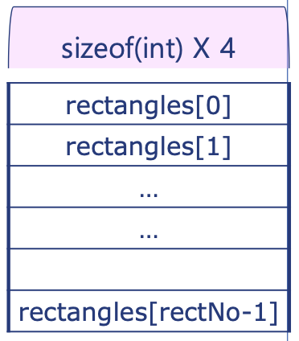

## Data members and Member function

### 객체의 동적 생성

- 방법1: [] 사용

  ```cpp
  #include <iostream>
  #include "Rectangle.h"
  using namespace std;

  int main(){
      int rectNo;
      cin >> rectNo;
      Rectangle* const rectangles = new Rectangle[rectNo];

      for (unsigned int i=0; i<rectNo; i++){
          cout << "Enter Rectangle information" << endl;
          int x1, y1, x2, y2;
          cin >> x1 >> y1 >> x2 >> y2;
          rectangles[i].set(x1, y1, x2, y2);
      }
      int totalArea = 0;
      for (unsigned int i=0; i<rectNo; i++){
          totalArea += rectangles[i].getArea();
      }

      delete [] rectangles;
      cout << "The total area: " << totalArea << endl;
  }

  ```

  

- 방법2: 포인터 사용

  (이해가 안됨....ㅠㅜㅠ 공부필요..!!)
