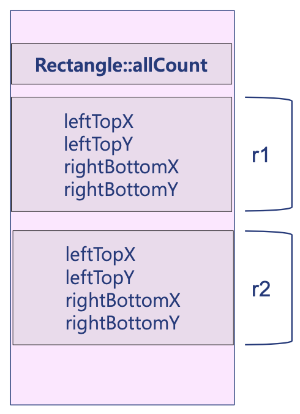

## Static Data member



Data member는 Rectangle 객체가 만들어 질때마다 확보되는 공간이다.

r1이 만들어 지면서 Data member가 할당 되고,

r2가 만들어 지면서 또 다른 Data member가 할당 된다.

static Data member는 오직 하나만 차지하고 이 하나에만 접근하게 한다.

### Example1

```cpp
// Rectangle.h
#ifndef Rectangle_h
#define Rectangle_h

class Rectangle {
    int leftTopX, leftTopY;
    int rightBottomX, rightBottomY;

    void setLeftTop(int x, int y){
        leftTopX = x;
        leftTopY = y;
    }
    void setRightBottom(int x, int y){
        rightBottomX = x;
        rightBottomY = y;
    }
public:
    static int allCount;

    Rectangle(){ allCount++; }   // 생성자: 객체 생성시 자동 호출

    ~Rectangle(){ allCount--; }   // 소멸자: 객체 소멸시 자동 호출

    void set(int x1, int y1, int x2, int y2){
        setLeftTop(x1, y1);
        setRightBottom(x2, y2);
    }
};
#endif
```

```cpp
// Rectangle.cpp
#include <iostream>
#include "Rectangle.h"

int Rectangle::allCount = 0;
```

```cpp
// RectangleMain.cpp
#include <iostream>
#include "Rectangle.h"
using namespace std;

int main(){
    Rectangle r1;
    r1.set(1,1,2,2);
    cout << Rectangle::allCount << endl;   // 1

    Rectangle r2;
    r2.set(10,10,20,20);
    cout << Rectangle::allCount << endl;    // 2

}
```

### Example2

```cpp
#include <iostream>
#include "Rectangle.h"
using namespace std;

Rectangle gRectangle1, gRectangle2;

int main(){
    cout << Rectangle::allCount << endl;    // 2

    Rectangle r1;

    cout << Rectangle::allCount << endl;    // 3

    for ( int i=0; i<3; i++){
        Rectangle r;
        cout << Rectangle::allCount << endl;    // 4
    }

    Rectangle* pR = new Rectangle;
    cout << Rectangle::allCount << endl;    // 4
    delete pR;
    cout << Rectangle::allCount << endl;    // 3
}
```

- Q: for문 안에서는 왜 증가하지 않을까?

- Q: new로 동적할당을 할 때는 왜 증가하지 않을까?

## Static member function

static member function은 static data member만 호출할 수 있다.

```cpp
// Rectangle.h
#ifndef Rectangle_h
#define Rectangle_h

class Rectangle {
    static int allCount;    // allCount 데이터 멤버는 private함.
    int leftTopX, leftTopY;
    int rightBottomX, rightBottomY;
public:
    // 정적 멤버함수는 정적 데이터 멤버만 호출가능.
    static int getAllCount(){return allCount;}
    static bool noRectangle(){return allCount == 0;}
    Rectangle(){allCount++;}
    ~Rectangle(){allCount--;}
};

#endif
```

```cpp
// Rectangle.cpp
#include <iostream>
#include "Rectangle.h"

int Rectangle::allCount = 0;

```

```cpp
// RectangleMain.cpp
#include <iostream>
#include <vector>
#include <string>
#include "Rectangle.h"
using namespace std;

int main(){
    vector<Rectangle*> rectangles;

    do {
        string command;
        cin >> command;

        if (command == "ADD"){
            rectangles.push_back(new Rectangle);

        }
        else if (command == "DELETE"){
            vector<Rectangle*>::iterator head = rectangles.begin();
            Rectangle* r = *head;
            delete r;
            rectangles.erase(head);
        }else {break;}

        cout << Rectangle::getAllCount() << endl;   // public static member (allCount 데이터멤버 private으로 정의)
    } while (Rectangle::noRectangle() == false);

    for (vector<Rectangle*>::iterator Iter = rectangles.begin(); Iter != rectangles.end(); Iter++){
        Rectangle* r = *Iter;
        delete r;
    }
}

```
