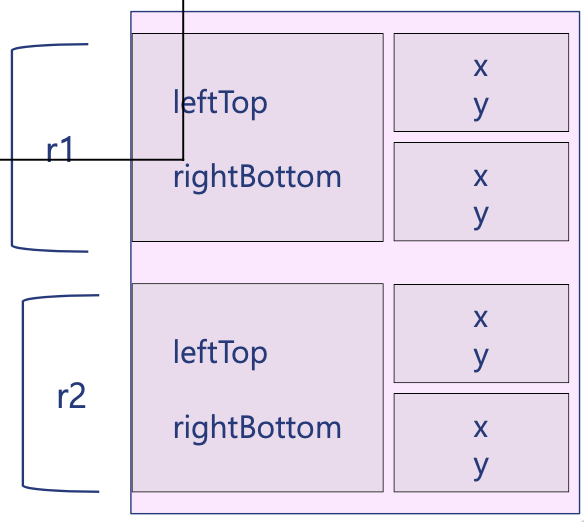
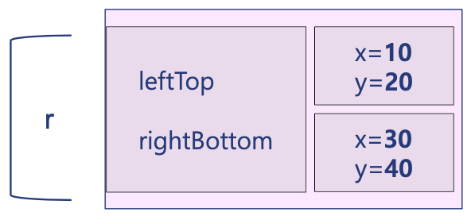

다른 클래스의 객체가 자신의 멤버로 사용될 때, 객체 데이터 멤버라고 한다.

## 구조

```cpp
// Point 클래스
class Point {
private:
  int x;
  int y;
public:
  Point(int _x=0, int _y=0){    // default값 0
    x = _x;
    y = _y;
  }
};

// Rectangle 클래스
class Rectangle {
private:
  Point leftTop;    // 다른 클래스의 객체가 자신의 멤버로 사용될 때 => 객체 데이터 멤버
  Point rightBottom;
public:
  ...
}
```



## 객체 데이터 멤버 초기화

```cpp
Rectangle(int x1, int y1, int x2, int y2)
  : leftTop(x1, y1), rightBottom(x2, y2)    // Point타입의 생성자 호출
  {}
```

```cpp
// main.cpp
int main(){
  ...
  Rectangle r(10, 20, 30, 40);
}
```



## Example: Computer and Monitor

```cpp
#include <iostream>
#include <string>
using namespace std;

class Monitor {
    string maker;
    int price;
public:
    Monitor(const string _maker, const int _price)
    : maker(_maker){   // maker초기화 (maker는 string객체 -> 멤버 이니셜라이즈 사용)
        price = _price ;    // price 초기화 (price는 int -> body에서 초기화)
    }
    void display(const string& msg){
        cout << maker << ": " << msg << endl;
    }
    int getPrice(){ return price; }
};

class Computer {
    string maker;    // string 객체를 데이터 멤버로 가짐
    Monitor monitor;    // Monitor 객체를 데이터 멤버로 가짐
    int price;
public:
    Computer(const string& _maker, const Monitor& _monitor, const int _price)
        :maker(_maker), monitor(_monitor){   // maker, monitor는 각각 string, Monitor객체임으로 멤버 이니셜라이즈 이용
            // 두번째 인자로 넘겨준 Monitor클래스의 samsungMonitor로 초기화
            price = _price;    // price는 int타입이라서 Computer생성자의 body에 위치
        }
    void run(const string& msg){
        cout << "Runs on " << maker << endl;
        monitor.display(msg);
    }
    int getPrice(){ return price; }
};


int main(){
    Monitor samsungMonitor("SamsungMonitor", 100);
    Computer samsungPC("Samsung", samsungMonitor, samsungMonitor.getPrice() + 200);

    cout << samsungPC.getPrice() << endl;
    samsungPC.run("Hello C++");
}

```
