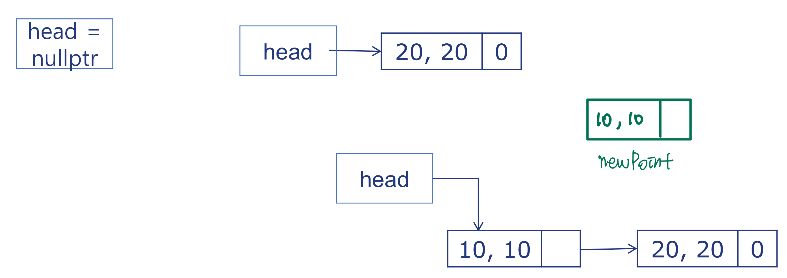
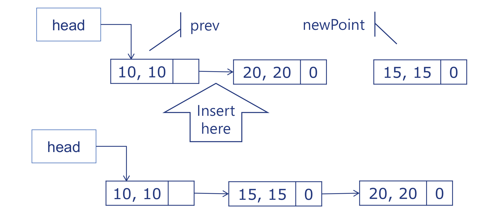
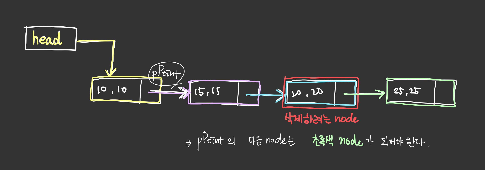

- node

- 양방향

- 0은 연결된 다음 포인터가 없다는 뜻

```cpp
// Point 클래스
class Point {
    int x, y;
    Point* pNext;
public:
    Point(int _x=0, int _y=0, Point* const _pNext=nullptr){
        x = _x;
        y = _y;
        pNext = _pNext;
    }
    Point* getNext(){ return pNext; }
    void setNext(Point* const _pNext){
        pNext = _pNext;
    }
    void print(){
        cout << x << "," << y << endl;
    }
};
```

```cpp
// SinglyLinkedList 클래스 : Pointer 리스트 관리
class SinglyLinkedList {
    Point* head;  // 첫번째 포인터만 관리하면 됨!
public:
    SinglyLinkedList(){ head = nullptr; }
    void print() {
        Point* pPoint = head;
        while (pPoint != nullptr){
            pPoint -> print();
            pPoint = pPoint -> getNext();
        }
    }
    void prepend(Point* const newPoint){ // head 다음 제일 첫 위치에 새로운 Point를 추가!
        if (head == nullptr){
            head = newPoint;
        } else {   // head가 null이 아니면 head가 newPoint를 가리키게 하자!
            newPoint -> setNext(head);  // newPoint의 다음 node를 head로 함.
            head = newPoint;    // newPoint가 head가 됨.
        }
    }
    void insertAfter(Point* const prev, Point* const newPoint){
        assert( prev != nullptr );
        newPoint->setNext(prev->getNext());
        prev->setNext(newPoint);
    }
    void remove(Point* const toBeRemoved){
        if ( toBeRemoved == head ){
            head = head->getNext();
            return;
        }
        Point* pPoint = head;
        while ( pPoint != nullptr ){
            if ( pPoint->getNext() == toBeRemoved ){
                Point* pNextOfToBeRemoved = toBeRemoved->getNext();  // 삭제될 node의 다음 node를 pNextOfToBeRemoved라고 정의.
                pPoint->setNext(pNextOfToBeRemoved);    // pPoint의 다음 노드로 pNextOfToBeRemoved를 가리킴.
                break;
            }
            pPoint = pPoint->getNext();    // pPoint가 가리키는 node의 다음 noderk toBeRemoved가 될 때를 찾기 위해서.
        }
    }
};
```

- prepend()
  

  head가 null이 아닐때,

  1. newPoint의 다음 노드를 head로 함

  2. newPoint를 head로 정의

- insertAfter()
  

  추가하고 싶은 곳의 previous node를 prev 인자로 전달.

  1. newPoint의 next node로 previous node의 이전의 next node를 가리킴.

  2. previous node의 next node로 newPoint를 가리킴.

- remove()
  
