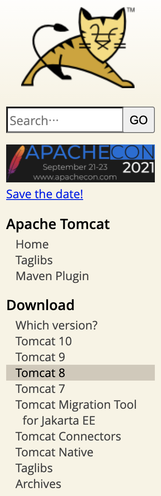
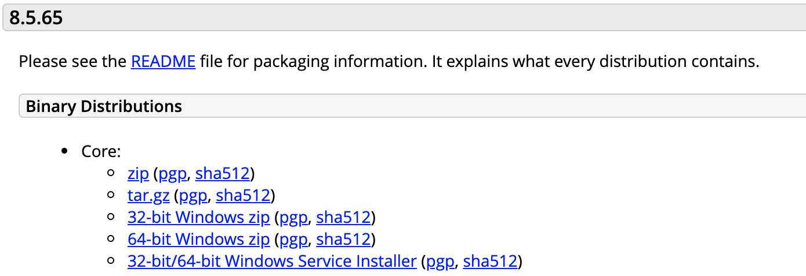
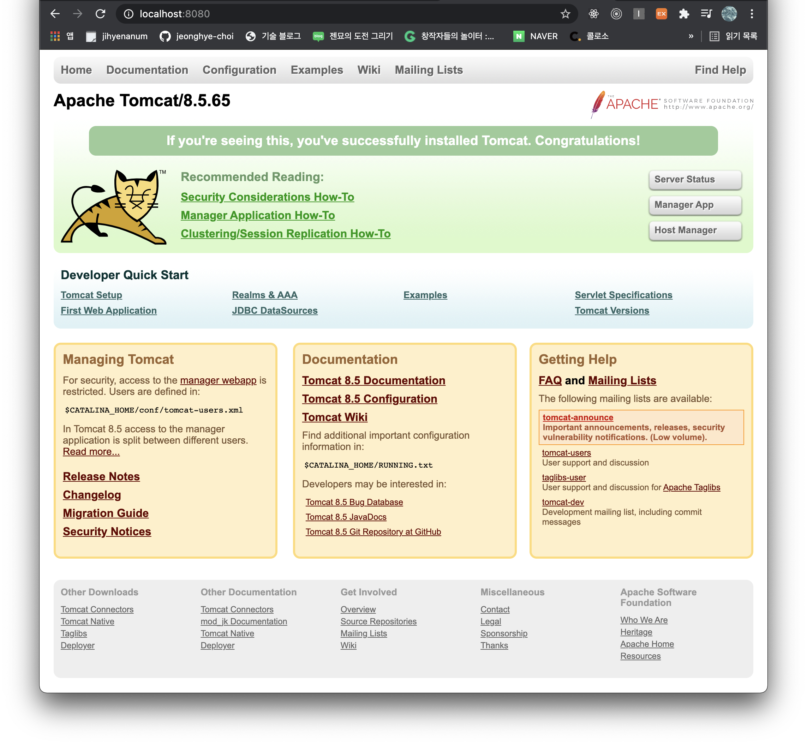
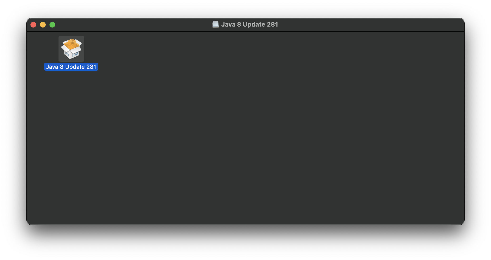

[http://tomcat.apache.org/](http://tomcat.apache.org/)

위 사이트에 접속해서 tomcat을 다운받는다.

### 1. 원하는 버전을 선택



<br/>

### 2. Core에 **"tar.gz(pgp, sha512)"** 클릭해서 다운받기


<br/>

### 3. 다운받은 파일을 압축해제하고, 원하는 디렉토리로 옮깁니다.

(저는 바탕화면에 옮겼어요!)
<br/>

### 4. 터미널에 해당 명령어를 입력해줍니다.

```terminal
sudo mkdir -p /usr/local

sudo mv ~/Desktop/<압축해제한 폴더명> /usr/local

sudo rm -f ~/Library/Tomcat

sudo ln -s /usr/local/<압축해제한 폴더명> /Library/Tomcat

sudo chown -R <맥북 user id> /Library/Tomcat

sudo chmod +x /Library/Tomcat/bin/*.sh
```

- 맥북 user id 확인하기 (터미널에 아래 명령어 입력!)

```terminal
echo $USER
```

<br/>

### 5. 톰캣 실행

```terminal
sudo /Library/Tomcat/bin/startup.sh
```

**http://localhost:8080** 주소로 들어가면,


<br/>

#### 발생할 수 있는 에러

- The operation couldn’t be completed. Unable to locate a Java Runtime.

  java를 다운받으면 된다.

  [http://www.java.com](http://www.java.com)

  위 사이트에 접속해서 다운받아준다.

  

  

  설치후 다시 실행하면

  ```terminal
  % sudo /Library/Tomcat/bin/startup.sh

  Using CATALINA_BASE:   /Library/Tomcat
  Using CATALINA_HOME:   /Library/Tomcat
  Using CATALINA_TMPDIR: /Library/Tomcat/temp
  Using JRE_HOME:        /Library/Internet Plug-Ins/JavaAppletPlugin.plugin/Contents/Home
  Using CLASSPATH:       /Library/Tomcat/bin/bootstrap.jar:/Library/Tomcat/bin/tomcat-juli.jar
  Using CATALINA_OPTS:
  Tomcat started.
  ```

  **http://localhost:8080** 주소로 들어가면 끝!

<br/>

### 6. 톰캣 서버 종료

```terminal
sudo /Library/Tomcat/bin/shutdown.sh
```

<br/>

### 참고자료

[Junseo Kim's velog](https://velog.io/@max9106/Mac-apache-tomcat%ED%86%B0%EC%BA%A3-%EC%84%A4%EC%B9%98-l0k4zt4f3c)
