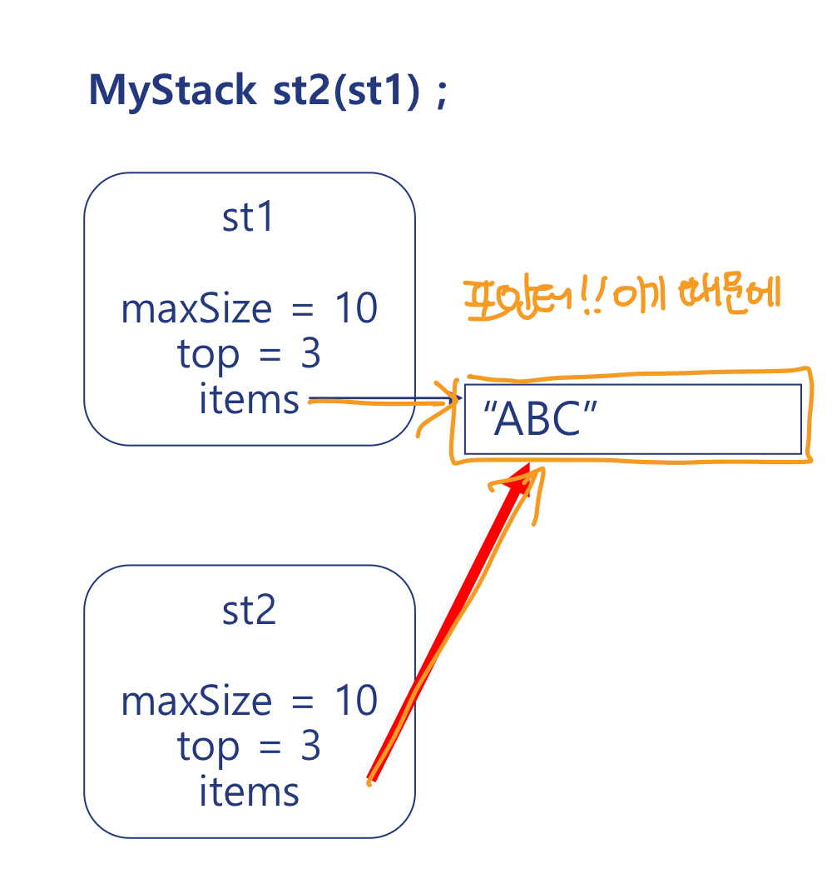
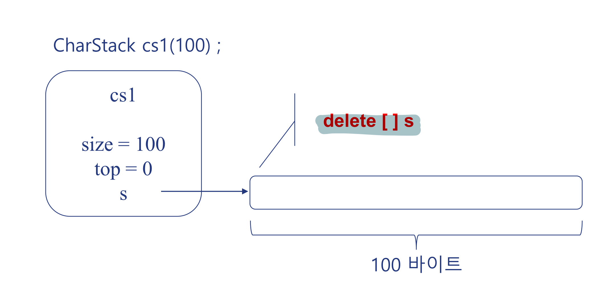

## Constructor

초기화를 하지 않으면 -> 문제가 발생할 수 있다.

생성자는 두 개의 단계로 구성되어 있는데,

1 전역변수, 지역변수, 힙 등 객체를 위한 메모리 공간 할당

2 메모리 공간을 초기화하기 위한 초기화 함수가 자동으로 호출된다.

따라서, 객체가 생성될 때, 초기상태가 있어야한다.

- 구조

  constructor는 객체가 생성될 때 자동 호출.

  클래스와 이름이 같고 return type이 없다.

  ```cpp
  class Rectangle {
      int leftTopX, leftTopY;
      int rightBottomX, rightBottomY;
  public:
      Rectangle(int x1, int y1, int x2, int y2){
          leftTopX = x1;
          leftTopY = y1;
          rightBottomX = x2;
          rightBottomY = y2;
      }
  }
  ```

- 생성자 호출

  ```cpp
  int main(){
      int x1, y1, x2, y2;
      cin >> x1 >> y1 >> x2 >> y2;

      Ractangle r1(x1, y1, x2, y2);  // 생성자(constructor) 호출

      int x3, y3, x4, y4;
      r1.getLeftTop(x3, y3);
      r1.getRightBottom(x4, y4);

      Rectangle* const pR = new Rectangle(x3, y3, x4, y4);   // 생성자 호출

      cout << endl r1.getArea() << '\t' << pR->getArea() << endl;

      delete pR;
  }
  ```

### Constructor overloading

```cpp
#include <iostream>
using namespace std;

class Point {
public:
    int x,  y;
    Point(int x, int y) {
        this->x = x;
        this->y = y;
    }
};

class Rectangle {
    int leftTopX, leftTopY;
    int rightBottomX, rightBottomY;
public:
    // 1번 생성자 (int type 4개)
    Rectangle(int x1, int  y1, int x2=0, int y2=0){
        set(x1, y1, x2, y2);
    }

    // 2번 생성자 (int type 2개) --> 불필요! : 위에처럼 default를 인자에 주면 된다.
    // => 같은 생성자를 쓰게되면 : ERROR 'Call to constructor of 'Rectangle' is ambiguous.

    //Rectangle(int x, int y) {
    //    set(x, y, 0, 0);
    //}

    // 3번 생성자 (const reference 2개)
    Rectangle(const Point& leftTop, const Point& rightBottom=Point(0,0)){
        set(leftTop.x, leftTop.y, rightBottom.x, rightBottom.y);
    }

    // 4번 생성자 (const reference 1개) --> 불필요 : 위에처럼 default를 인자에 주면 된다.
    // => 같은 생성자를 쓰게되면 : ERROR 'Call to constructor of 'Rectangle' is ambiguous.

    //Rectangle(const Point& leftTop){
    //    set(leftTop.x, leftTop.y, 0,0);
    //}

    void set(int x1, int y1, int x2, int y2){
        leftTopX = x1;
        leftTopY = y1;
        rightBottomX = x2;
        rightBottomY = y2;
    }
};

int main(){
    int x1, y1, x2, y2;
    cin >> x1 >> y1 >> x2 >> y2;

    Rectangle r1(x1, y1, x2, y2);

    Rectangle* const pR2 = new Rectangle(x1+10, y1+10);

    Point p1(10, 10), p2(20, 20);

    Rectangle r3(p1, p2);

    Rectangle* const pR4 = new Rectangle(Point(30, 30));

    delete pR2;
    delete pR4;
}

```

### Default constructor

인자없이 생성자 호출, 각 인자에 default 값이 있는 경우

- default constructor

  ```cpp
  class Rectangle {
    int leftTopX, leftTopY;
    int rightBottomX, rightBottomY;
  public:
    Rectangle(){ set(0,0,0,0); }
  };
  ```

- 각 인자에 default값 있는 경우

  ```cpp
  class Rectangle {
    int leftTopX, leftTopY;
    int rightBottomX, rightBottomY;
  public:
    Rectangle(int x1=0, int y1=0, int x2=0, int y2=0){
        set(x1, y1, x2, y2);
    }
  };
  ```

  ```cpp
  // main 함수
    int main(){
        Rectangle r1;
        // Rectangle r1() <-- 사용X
        // Rectangle 타입의 함수 r1() 선언으로 해석될 수 있음!

        r1.print();

        Rectangle r2;
        r2.print();

        Rectangle* const pR = new Rectangle();
        pR -> print();

        delete pR;
    }

  ```

생성자가 정의되어 있지 않으면 -> compiler가 생성자 자동 생성한다.

```cpp
class Rectangle {
    int leftTopX, leftTopY;
    int rightBottomX, rightBottomY;
public:
    // 생성자 없음
    ...
    void set(int x1, int y1, int x2, int y2){...}
}


int main(){
    Rectangle r1;
    r1.print()   // garbage값이 나옴

    Rectangle* const pR = new Rectangle();
    pR->print();   // 0,0,0,0
    delete pR;

    Rectangle r2 = Rectangle();
    r2.print();   // 0,0,0,0

    Rectangle r3{};   // since C++11
    r3.print();
}
```

### Member initializer

- 객체 배열 초기화

  ```cpp
  class Point {
  public:
      int x, y;
      Point(int _x=0, int _y=0)
      : x(_x), y(_y) {}
  };

  class Rectangle{

  public:
      ...
      Rectangle(){...}  // default 생성자

      Rectangle(int x1, int y1, int x2, int y2){ ... }

      Rectangle(int x, int y) { set(x, y, 0, 0); }

      Rectangle(const Point& leftTop, const Point& rightBototm){ ... }

      Rectangle(const Point& leftTop){ ... }
  }

  int main(){
      Rectangle rectangles1[10];

      Rectangle rectangles2[] = {
          Rectangle(),   // default 생성자
          Rectangle(10,10,20,20),
          Rectangle(10,10),
          Rectangle(Point(10,10), Point(20,20)),
          Rectangle(Point(10,10))
      };

      int rectNo;
      cin >> rectNo;
      Rectangle* const pRectangle1 = new Rectangle[rectNo];
      delete [] pRectangles1;

      Rectangle* const pRectangle2 = new Rectangle[rectNo]{
          Rectangle(10,10,20,20),
          Rectangle(10,10)
      };
      delete [] pRectangle2;
  }
  ```

- 멤버 초기화

  - 위치

    ```cpp
    class Rectangle {
        int leftTopX, leftTopY;
        int rightBottomX, rightBottomY;
    public:
        Rectangle(int x1=0, int y1=0, int x2=0, int y2=0)
        : leftTopX(x1), leftTopY(y1)  // 멤버 초기화 목록
        {
            // body: 함수 본문
            rightBottomX = x2;
            rightBottomY = y2;
        }
    }
    ```

- 멤버 객체(Member Object) 초기화

  데이터 멤버 초기화는 **":"** 사용.

  ```cpp
  #include <iostream>
  using namespace std;

  class Point {
      int x,y;
  public:
      Point(int x=0, int y=0){
          this->x = x;
          this->y = y;
      }
  };

  class Rectangle {
      Point rightBottom, leftTop;
  public:
      // 1번 생성자
      Rectangle(const Point& p1, const Point&  p2=Point(0,0))
      :leftTop(p1), rightBottom(p2){
          cout << "1번 생성자" << endl;
      }  // member initializer
      // 만약 rightBottom(p2)이 없다면(멤버를 초기화하지 않았다면) -> rightBottom() 즉, 기본 생성자를 호출할 거다.

      // 2번 생성자
      Rectangle(int x1, int y1, int x2=0, int y2=0)
      :leftTop(x1, y1), rightBottom(x2, y2){
          cout << "2번 생성자" << endl;
      }

      // 3번 생성자
      Rectangle() // 생략가능함! default constructor를 호출하기때문에.
      // :leftTop(), rightTop() <-- 기본생성자 호출
      {
          cout << "3번 생성자: default constructor" << endl;
      }

  };

  int main(){
      cout << "\n" << "Rectangle r1;" << endl;
      Rectangle r1;

      Point p;

      cout << "\n" << "Rectangle r2(p, p);" << endl;
      Rectangle r2(p, p);

      cout << "\n" << "Rectangle r3(p);" << endl;
      Rectangle r3(p);

      cout << "\n" << "new Rectangle(100, 200);" << endl;
      Rectangle* const pR4 = new Rectangle(100, 200);

      cout << "\n" << "new Rectangle(100);" << endl;
      Rectangle* const pR5 = new Rectangle(100);


      delete pR4;
      delete pR5;
  }
  ```

  ```cpp
  // 실행결과
  Rectangle r1;
  3번 생성자: default constructor

  Rectangle r2(p, p);
  1번 생성자

  Rectangle r3(p);
  1번 생성자

  new Rectangle(100, 200);
  2번 생성자

  new Rectangle(100);
  1번 생성자
  ```

- member Initializer 용도

  객체, const, reference는 모두 initializer로 초기화 해야한다!

  ```cpp
  #include <string>
  #include <vector>
  using namespace std;

  enum Grade { FRESH=1, SOPHOMORE, JUNIOR, SENIOR };

  class Student;

  class School {
      const string name;  // const 멤버는 반드시 member initializer로 초기화 해야함
      vector<Student*> students;   // 멤버객체는 반드시 member initializer로 초기화 해야함
      float budget;
  public:
    School(const string& _name, int size)
    : name(_name), Students(size)
    { budget=0; }  // budget member initializer로 초기화 가능:)
  }

  class Student {
      string name;
      Grade grade;
      const School& school;   // reference 멤버는 반드시 member initializer로 초기화 해야함.
  public:
      Student(const School& _school, const string& _name="")
      :school(_school), name(_name)
      { grade = FRESH; }
  };
  ```

### Copy constructor

셍성자의 인자가 자기 자신이다.

그래도 받으면 overhead가 크기 때문에, &(reference)해서 overhead 피하기!

```cpp
#include <iostream>
using namespace std;

class Point {
    int x, y;
public:
    Point(int x=0, int y=0) {  // 일반 생성자
        this->x = x;
        this->y = y;
    }
    Point(const Point& pt){  // 복사 생성자
        // 인자로 들어온 Point값을 자기자신의 값으로 정하는 것 (= 인자의 Point를 복사^^)
        x = pt.x;
        y = pt.y;
    }
    int getX() const {
        return x;
    }
    int getY() const {
        return y;
    }
};

Point readPoint(){
    int x, y;
    cin >> x >> y;
    return Point(x,y);
}

void print(const Point pt){
    // pt는 print()함수 내부 stack이 잡힌다. 즉, 참조가 아니기 때문에 "call by value"
    // pt2가 pt로 전덜되어야한다(복사)
    // 이때, copy constructor 호출
    cout << pt.getX() << ", " << pt.getY() << endl;
}

int main(){
    Point pt1;  //일반 생성자

    pt1 = readPoint();  // return Point(x,y)로 만들어진 객체를 복사!해서 pt1에 넣는다.
    Point pt2(pt1);  // 복사생성자 호출 pt1 복제 -> pt2
    print(pt2);
}
```

복사 생성자(copy constructor)가 명시되지 않았다면 컴파일러가 복사생성자를 자동으로 생성한다.

```cpp
// 자동을 생성된 복사 생성자
Point(const Point& pt) { x=pt.x; y=pt.y }
```

compiler가 자동으로 copy constructor를 만들어주는데 굳이 정의해야할까??

=> 아래 예시 참고

```cpp
#include <iostream>
#include <cstring>
using namespace std;

const int DEFAULT_MAX_SIZE = 10;

class MyStack {
    char* const items;   // 포인터
    int top;
    const int maxSize;
public:
    MyStack(int _maxSize=DEFAULT_MAX_SIZE)
    : maxSize(_maxSize), items(new char[_maxSize]) {
        top = 0;
    }
    MyStack(const char* const str)
    : maxSize(strlen(str) + DEFAULT_MAX_SIZE), items(new char[strlen(str) + DEFAULT_MAX_SIZE]){
        for (int i=0; i<strlen(str); i++){
            items[i] = str[i];
            top = strlen(str);
        }
    }
    void push(char c) {items[top++] = c;}
    char pop(){ return items[--top]; }
    void print() const {
        for(int i=0; i<top; i++){
            cout << items[i];
        }
        cout << endl;
    }
};

int main() {
    MyStack st1("ABC");    // not 'ABC'
    MyStack st2(st1);   // defualt copy constructor invoked

    st2.pop();
    st2.push('D');
    st2.print();  // ABD

    st1.print();   // ABD not ABC  <-- shallow copy
}
```

- strlen()

  const char\* 타입의 문자열을 받아서 해당 문자열의 길이를 반환하는 함수

  원형: size_t strlen(const char\* str);

- 문자 vs 문자열

  문자: 단 하나의 문자 -> ''(작은 따옴표)

  문자열: 문자들의 모임 -> ""(큰 따옴표)

위의 예시에서 st1이 st2의 변형에 영향을 받은 것을 알 수 있다.

이는 포인터가 가리키는 대상이 같기 때문이다. (주소를 가리키고 있기 때문에)



따라서, 우리가 원하는 복사가 일어나기 위해서는 명시적으로 copy constructor 를 정의해야한다.

```cpp
MyStack(const MyStack& another)
: top(another.top), maxSize(another.maxSize), items(new char[another.maxSize]){
    for (int i=0; i<top; i++){
        items[i] = another.items[i];
    }
}
```

## Destructor

constructor와 반대로 객체가 소멸할 때 호출된다.

대부분의 클래스들이 생성자에 의해 할당된 메모리를 사용하고, 소멸자로 인해 회수된다.

(new -> delete)

- 구조

  ```cpp
  #include <iostream>
  using namespace std;

  class Point {
      int x, y;
  public:
      Point(int x=0, int y=0){
          this->x = x;
          this->y = y;
          cout << "\tPoint";
          print();
          cout << " constructor" << endl;
      }
      ~Point(){
          cout << "\tPoint ";
          print();
          cout << " destructed." << endl;
      }
      void print() const {
          cout << "(" << x << "," << y << ")";
      }
  }
  ```

- 예시

  ```cpp
  #include <iostream>
  using namespace std;

  class Point {
      int x, y;
  public:
      Point(int x=0, int y=0){
          this->x = x;
          this->y = y;
          cout << "\tPoint";
          print();
          cout << " constructed." << endl;
      }
      ~Point(){
          cout << "\tPoint ";
          print();
          cout << " destructed." << endl;
      }
      void print() const {
          cout << "(" << x << ", " << y << ")";
      }
  };

  Point gP(100, 100);

  int main(){
      cout << "P1\n";
      Point p1;

      Point* pP2;
      {
          cout << "\nP2\n";

          Point p3(3,3);
          cout << "\nP3\n";
          pP2 = new Point(2,2);
      }
      delete pP2;
  }
  ```

  ```cpp
  // 출력결과
       Point(100, 100) constructed.
  P1
      Point(0, 0) constructed.
  P2
      Point(3, 3) constructed.
  P3
      Point(2, 2) constructed.
      Point (3, 3) destructed.  //
      Point (2, 2) destructed.  //
      Point (0, 0) destructed.  //
      Point (100, 100) destructed.  //
  ```

  본인이 정의된 블락을 벗어나면 소멸된다.

- 멤버 객체의 소멸

  ```cpp
  #include <iostream>
  using namespace std;

  class Point {
      int x,y;
  public:
      Point(int x=0, int y=0){
          this->x = x;
          this->y = y;
          cout << "\tPoint ";
          print();
          cout << " constructed." << endl;
      }
      ~Point(){
          cout << "\tPoint ";
          print();
          cout << " destructed." << endl;
      }
      void print() const {
          cout << "(" << x << "," << y << ")";
      }
  };

  class Rectangle {
      Point rightBottom, leftTop;
  public:
      Rectangle(const Point& p1, const Point& p2=Point(0,0))
      :leftTop(p1), rightBottom(p2){
          cout << "Rectangle: ";
          print();
          cout << " constructed." << endl;
      }
      Rectangle(int x1, int y1, int x2=0, int y2=0)
      : leftTop(x1, y1), rightBottom(x2, y2){
          cout << "Rectangle: ";
          print();
          cout << " constructed." << endl;
      }
      Rectangle(){
          cout << "Rectangle: ";
          print();
          cout << " constructed." << endl;
      }
      ~Rectangle(){
          cout << "Rectangle: ";
          print();
          cout << " destructed." << endl;
      }
      void print() const {
          leftTop.print();
          rightBottom.print();
      }
  };

  int main(){
      Point p(2,2);
      Rectangle r2(p);
  }
  ```

  ```cpp
  // 실행결과
      Point (2,2) constructed.
      Point (0,0) constructed.
  Rectangle: (2,2)(0,0) constructed.
      Point (0,0) destructed.
  Rectangle: (2,2)(0,0) destructed.
      Point (2,2) destructed.
      Point (0,0) destructed.
      Point (2,2) destructed.
  ```

- 소멸자의 역할

  ```cpp
  #include <iostream>
  using namespace std;

  class CharStack {
      int size;
      int top;
      char* const s;
  public:
      CharStack(int _size)
      :size(_size), s(new char[_size]) {
          top = 0;
          cout << "constructor invoked for Stack![" << size << "]" << endl;
      }
      CharStack(const CharStack& another)
      :size(another.size), top(another.top), s(new char[another.size]){
          for(int i=0; i<=top; i++){
              s[i] = another.s[i];
          }
      }
      ~CharStack(){
          delete [] s;  // CharStack이 생길때 마다 힙에 s만큼의 메모리가 할당된다. 따라서 소멸될때 생성한 s포인터들을 모두 없애야한다.
          cout << "destructor invoked for Stack[" << size << "]" << endl;
      }
  };

  int main(){
      CharStack cs1(100);   // main이 끝나도 자동으로 소멸되지 않는다
      // => main이 끝날때 소멸자가 호출되는데, 그때 소멸시켜줘야한다. (cs2의 경우도 마찬가지)
      for (int i=0; i<10; i++){
          CharStack cs2(100);
      }
  }
  ```

  

  ```cpp
  int main(){
      for (int i=0; i<1000; i++){
          CharStack cs(1000);
          ...
          // (1000 + 8) leaked
      } // 1000 * (1000 + 8) leaked
  }
  ```

## 생성자/소멸자 호출 순서

```cpp
class Rectangle {
    Point rightBottom;
    Point leftTop;
public:
    Rectangle(int x1, int y1, int x2=0, int y2=0)
    : leftTop(x1, y1), rightBottom(x2, y2)
    {...}

    ~Rectangle(){...}
}
```

- **Rectangle 생성시**

  1. rightBototm

  2. leftTop

  3. Rectangle() 본문

  => 초기화 순서X, 데이터멤버 정의 순서대로!

- **Rectangle 소멸시**

  1. ~Rectangle()

  2. leftToop

  3. rightBottom

  소멸될 때는, 생성될 때의 반대로 소멸됨.

## 예시

String 클래스 직접 만들기

```cpp
#include <iostream>
using namespace std;

class MyString {
    char* str;
    int size;
public:
    MyString(){
        str = NULL;
        size = 0;
    }
    MyString(const char* string)
    :size(strlen(string)), str(new char[strlen(string)]){
        for (int i=0; i != strlen(string); i++){
            str[i] = string[i];
        }
    }
    //copy constructor
    MyString(const MyString& another)
    :size(another.size), str(new char[another.size]){
        for(int i=0; i<size; i++){
            str[i] = another.str[i];
        }
    }
    ~MyString(){
        delete [] str;
    }
    void print(){
        for (int i=0; i<size; i++){
            cout << str[i];
        }
        cout << endl;
    }
    void set(const int& index, const char& c){
        str[index] = c;
    }
    int length(){
        return size;
    }
    char at(int& index){
        return str[index];
    }
};

int main(){
    MyString str1("ABC");
    str1.print();

    {
        MyString str2(str1);
        str2.set(0,'D');
        str2.print();
    }
    str1.print();

    for (int i=0; i<str1.length(); i++){
        cout << str1.at(i);
    }
}

```

```cpp
// 실행결과
ABC
DBC
ABC
ABC
```
